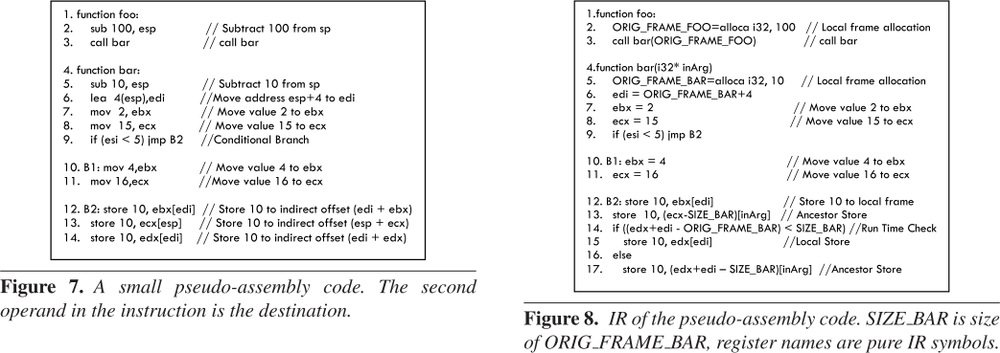
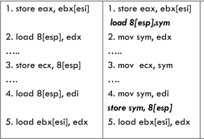

#### 21 March 2015
---------------------
1. Implemented a pass to "find the maximum stack height  growth"
  - The underlying algorithm is a forward data flow analysis.
  - Each program point is associated with the following data flow value : { actual_esp, actual_ebp, max_disp_esp, max_disp_ebp } where
    - actual_esp ( or actual_ebp): Actual displacement of rsp (or rbp). For example, for a statement ```sub $0x20,%rsp```, if esp value is x before the statement, then  actual_esp becomes x - 32 after it.
    - max_disp_esp ( or max_disp_ebp): offset of the stack access w.r.t rsp (or rbp). For example, for a statement ```mov -0x4(%rsp),%esi```, if esp value is x before the statement, then max_disp_esp becomes x-4 after it.
    - Note that both actual_esp and max_disp_esp need to be separately tracked. 
      - Problem with having only actual_esp
      ```
        sub $0x8,%rsp
        mov -0xc(rsp), %edi //actual_esp = -8, but   max stack height = -0xc
      ```
      - Problem with having only max_disp_esp (in negative direction)
      ```
        sub $0x8,%rsp
        sub $0xc,%rsp // max_disp_esp = -0xc, but  max stack height = -0x14
      ```
      - Also just adding the offsets will not do.
      ```
        mov -0x8(rsp), %edi
        sub $0xc, %rsp        // Adding the constants gives max stack height as 0x14, but its actually -0xc. 
      ```
  - local dfa within a bb: Calculating Gen[bb]
    - Each instruction I (which may potentially affect rsp or rbp) within a bb is tracked to obtain the data flow values before, In[I] and after, Out[I] .
      [This example](fig_1.png) captures all kinds of instructions considered and how the data values are propagted within the instructions of a bb.  
    - After the data value propagation, Gen[bb] is computed as follows:
      - Gen[bb]::actual_esp: Actual displacement of esp across the bb with value of rsp/rbp assumed as 0.
      - Gen[bb]::max_disp_esp: max (Out[I]::max_disp_esp) for all I in bb.

    In the running example, Gen[bb] = { -8, -64, 0, 0}                                   

  - Global dfa
    - Meet operator: For any pair of predecessor blocks pred_bb_x and pred_bb_y of bb,
    ```
      if ( Out[pred_bb_x]::actual_esp == OUT[pred_bb_y]::actual_esp &&  
          OUT[pred_bb_x]::actual_ebp == OUT[pred_bb_y]::actual_ebp) {
        In[bb]::actual_esp  = Out[pred_bb_x]::actual_esp;
        In[bb]::actual_ebp  = Out[pred_bb_x]::actual_ebp;
        In[bb]::max_disp_esp  = min ( OUT[pred_bb_x]::max_disp_esp, OUT[pred_bb_y]::max_disp_esp)
        In[bb]::max_disp_ebp  = min ( OUT[pred_bb_x]::max_disp_ebp, OUT[pred_bb_y]::max_disp_ebp)
      } else {
        In[bb] = Bottom
      }
    ```
    
    - Transfer function
    ```
    if(In[bb] == Bottom) {
      Out[bb] =  Bottom;
    } else {
      Out[bb]::actual_esp = In[bb]::actual_esp + Gen[bb]::actual_esp;
      Out[bb]::actual_ebp = In[bb]::actual_ebp + Gen[bb]::actual_ebp;
      Out[bb]::max_disp_esp = min ( In[bb]::actual_esp + Gen[bb]::max_disp_esp, In[bb]::max_disp_esp;
      Out[bb]::max_disp_ebp = min ( In[bb]::actual_ebp + Gen[bb]::max_disp_ebp, In[bb]::max_disp_ebp;
    }
    ```

    [This example]
    (https://github.com/sdasgup3/binary-decompilation/blob/master/source/test/max-stack-height/test_5/cfg.png)
    shows two cfgs corresponding to main (bigger one) and draw routines of [maze
    program](https://github.com/sdasgup3/binary-decompilation/blob/master/source/test/max-stack-height/test_5/test_5.c)
    with the following interpretation 
    

  - Max stack height of functopn F:  max ( Out[BB]::max_disp_esp and  Out[BB]::max_disp_esp ) for  all BB.  

2. Tested the implementation.
  - A [testsuite] (../source/test/max-stack-height/) is incrementatlly created. 


#### 7 March 2016 
-------------
* variable recovery algorithm 
  1. Deconstruct the monolithic stack that mcsema uses into local stack for each procedure.
    - Use a data flow analysis to identify the max stack height of each procedure. Its OK to have the 
 a variable expresion for max stack height. 
    - Allocate an array of "max stack height" right at the beginnig of each procedure.
  2. For each procedure, convert the accesses on that monolithic stack into accesses on the local stack.
  3. For each procedure, identify the abstract locations on its local stack corresponding to recovered variable.
  4. Promote the abstract locations into variables. 


##### Step 1-2
Consider the source code,
```
int main(){ 
  int z; 
  z = foo(10,20); 
  return z;
} 

int foo(int a, int b) { 
  int temp1; 
  temp1 = a+b; 
  return temp3;
}
```

In the mcsema recovered IR, all the 
stack memory acceses are going on a monolithic array r.RSP. 

```
int main(struct regcntx r){ 
  r.RSP = r.RSP-2; //Local Allocation
  
  r.RSP[1] = 20; //Outgoing argument 
  r.RSP[0] = 10; 
  
  int llvm_tmp_3 = rewritten_foo(r); 
  return llvm_tmp3;
}

int rewritten_foo(struct regcntx r) {
  int* llvm_EBP = r.RSP; //Local Frame Pointer
  llvm_RSP = llvm_RSP-10; //Local Allocation

  int tmpIn1 = llvm_EBP[0]; //Incoming Arg 
  int tmpIn2 = llvm_EBP[1];

  int llvm_tmp2 = tmpIn1+tmpIn2; 
  llvm_RSP[2] = llvm_tmp2;

  return llvm_tmp2;
}

```

The first step is localize the monolithic array
to each procedure.

```
int main(struct regcntx r){ 
  int LOCAL\_FRAME[MAX\_MAIN];
  
  LOCAL_FRAME[0] = 20; //Outgoing argument 
  LOCAL_FRAME[1] = 10; //Outgoing argument 

  int temp1 = LOCAL_FRAME[0];
  int temp2 = LOCAL_FRAME[1];
  
  int temp3 = rewritten_foo(temp1, temp2); 
  return temp3;
}

int rewritten_foo(int arg1, int arg2) {
  int LOCAL_FRAME[MAX_FOO];


  int temp = tmpIn1+tmpIn2; 
  LOCAL_FRAME[0] = temp;

  return temp;
}

```

###### Challenges


##### Step 3-4
##### Symbol promotion


